# CRM - Deep Research and Logic Build

Prepared for: BnC Global Partner Portal  
Assigned to: Rohan Rajasekhar Dangi  
Prepared on: 19 May 2026  
Status: Research + logic draft for implementation planning

---

## Table of Contents

- [[#1. Short Summary]]
- [[#2. Current Portal Understanding]]
- [[#3. Main CRM 360 Idea]]
- [[#4. Website Data Integration Logic]]
- [[#5. Partner CRM Logic]]
- [[#6. Sales Lead Management Logic]]
- [[#7. WhatsApp Automation Integration]]
- [[#8. Email Automation Integration]]
- [[#9. Browser-Based Calling Logic]]
- [[#10. AI Automation Logic]]
- [[#11. CRM Dashboard, Reports and Data Flow]]
- [[#12. Recommended Database Requirements]]
- [[#13. Integration Requirements]]
- [[#14. Automation Logic]]
- [[#15. Cost Factors]]
- [[#16. Implementation Plan]]
- [[#17. Risks and Points to Confirm]]
- [[#18. Research Sources Checked]]
- [[#19. Final Practical Recommendation]]

---

## 1. Short Summary

The main goal is to bring all website data into one CRM 360 module. Right now the portal already has partner registration, partner login, partner profile completion, service enquiry, expert request, voice requirement and admin dashboard logic connected with Supabase.

The CRM 360 module should build on this existing setup and make it more complete. Every enquiry, registration, partner action, form submission, call, WhatsApp message, email, follow-up and user activity should become one clear CRM record.

In simple words, the CRM should answer these questions:

- Who contacted us?
- Where did the lead or partner come from?
- What did they ask for?
- Who is handling it?
- What was the last action?
- What should happen next?
- Did WhatsApp, email, call or AI action happen properly?
- Which leads and partners are stuck?
- What is the business performance from website, partners, campaigns and team work?

This document is written as a practical logic note, not only as a feature list. Some vendor pricing and limits must be checked again before final buying because WhatsApp, email, calling and AI costs can change.

---

## 2. Current Portal Understanding

Based on the current project files, the portal is mainly:

- Frontend: React with Vite
- Backend/data: Supabase
- Existing data tables/functions found in project:
  - `partner_profiles`
  - `partner_ai_profiles`
  - `partner_onboarding_progress`
  - `service_enquiries`
  - `expert_requests`
  - `voice_requirements`
  - `admin_profiles`
  - `admin_partner_overview`
  - Supabase Edge Functions for Brevo email notifications
- Current admin dashboard already shows partner CRM data like:
  - total partners
  - AI profile complete
  - pending profiles
  - new registrations this month
  - partner table with agreement and onboarding status

This means the CRM should not be built from zero. The better approach is to extend the current portal into a full CRM layer.

---

## 3. Main CRM 360 Idea

The CRM should have one common customer/partner view. This is the 360 view.

Each person or company may have:

- basic profile details
- website form submissions
- partner registration
- service enquiries
- lead stage
- follow-up history
- WhatsApp chats
- email history
- call history
- documents and agreement status
- campaign source
- activity timeline
- AI notes and suggestions

One record should not be scattered across many screens. The user should open one CRM profile and see full history.

### Recommended CRM Sections

1. CRM Overview
2. Website Leads
3. Sales Leads
4. Partners
5. Clients
6. Campaigns
7. Follow-ups
8. WhatsApp
9. Email
10. Calls
11. AI Assistant
12. Reports
13. Settings and Integrations

---

## 4. Website Data Integration Logic

### 4.1 Website Inquiry Data Flow

Website inquiry data should be captured from all public and logged-in forms. The portal already has service enquiry and expert request flows. These should be connected to a common CRM lead table.

Example sources:

- service enquiry form
- talk to expert form
- partner registration form
- contact form
- voice requirement form
- WhatsApp click button
- campaign landing page
- referral page

### 4.2 Website Inquiry Flow

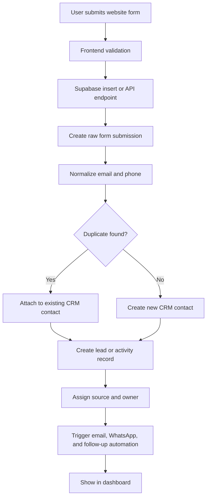

### 4.3 Registration Form Data Flow

For partner registration, the system should:

1. Validate name, email, phone, country and city.
2. Normalize email to lowercase.
3. Check duplicate email before account creation.
4. Create Supabase auth user.
5. Create/update `partner_profiles`.
6. Create CRM contact record.
7. Create partner CRM record.
8. Add timeline event: `Partner Registered`.
9. Send internal notification email.
10. Send welcome email/WhatsApp if template is approved.

Current portal already does some of this. The missing part is common CRM record creation and timeline tracking.

### 4.4 Partner Website Data Tracking

Partner website tracking should include:

- partner type page visited
- services viewed
- country selected
- form opened
- form submitted
- profile started
- AI profile started/completed
- agreement opened/signed
- dashboard login
- requirement submitted

This should be stored in a `crm_activities` table so admin can see the full journey.

### 4.5 Contact Form Tracking

Every contact form should save:

- name
- email
- phone
- company
- country
- message
- page URL
- source
- UTM campaign values
- browser/device basic info
- submission time
- spam score if available
- assigned team member

### 4.6 User Activity Tracking

Track only useful business events. Do not track too much private behaviour.

Recommended activity events:

- page visited
- CTA clicked
- form opened
- form submitted
- login
- profile updated
- document uploaded
- agreement signed
- email sent/opened/clicked
- WhatsApp sent/delivered/read/replied
- call started/completed/missed
- follow-up added
- lead stage changed

### 4.7 Source Tracking

Each lead and partner should have:

- original source
- latest source
- UTM source
- UTM medium
- UTM campaign
- UTM content
- referrer URL
- landing page
- IP country if legally allowed

Example:

```text
original_source = google
latest_source = whatsapp_campaign
utm_campaign = saudi_partner_may_2026
landing_page = /partnerships/international
```

### 4.8 Duplicate Data Handling

Duplicate handling should not delete data. It should merge or link data safely.

Matching priority:

1. exact email match
2. exact phone match with country code
3. same company + same email domain
4. fuzzy name match only for admin suggestion, not auto-merge

Recommended logic:

- If email exists, attach new submission to same contact.
- If phone exists but email is different, create duplicate warning.
- If same company and domain exists, suggest possible match.
- Never overwrite important old data without timeline entry.
- Keep raw submission separately for audit.

### 4.9 CRM Record Creation Logic

For every new website event:

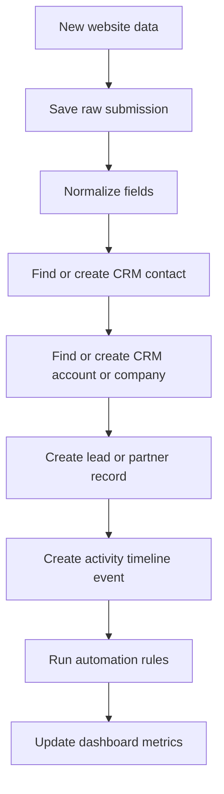

### 4.10 Website-to-CRM Automation

Automation should happen after record creation, not before. This avoids losing the enquiry if WhatsApp or email fails.

Automation examples:

- send internal notification to team
- send confirmation email to user
- send WhatsApp template if consent exists
- assign lead owner
- create follow-up task
- notify admin if high-value lead
- use AI to summarize message and suggest priority

### 4.11 Data Validation and Security

Important validation:

- email format
- phone with country code
- required fields by form type
- message length limit
- file upload type/size limit
- spam protection
- consent checkbox for marketing communication

Security logic:

- Keep Supabase service role key only in server/Edge Functions.
- Enable Row Level Security on CRM tables.
- Admins can view all CRM data.
- Partners can view only their own profile and submissions.
- Public forms should insert only allowed fields.
- Store audit logs for important changes.
- Do not expose WhatsApp, email, AI or calling API keys to frontend.

Research note: Supabase docs recommend RLS for tables exposed through the API and Edge Functions can be used for third-party integrations and webhook handling.

---

## 5. Partner CRM Logic

### 5.1 Partner Registration Tracking

Every partner registration should create:

- partner profile
- CRM contact
- partner CRM record
- registration activity
- owner assignment
- onboarding status
- follow-up task if profile is incomplete

Recommended partner stages:

1. Registered
2. Email Verified
3. Profile Pending
4. AI Profile Started
5. AI Profile Completed
6. Agreement Pending
7. Agreement Signed
8. Under Review
9. Approved
10. Active
11. Rejected / On Hold

### 5.2 Inquiry Form Tracking

Partner inquiry forms should be linked to:

- partner ID if logged in
- partner email if provided
- service/category
- country
- source page
- requirement text
- uploaded/voice file if any
- assigned team member
- next follow-up date

The current `service_enquiries`, `expert_requests`, and `voice_requirements` tables can feed into a common `crm_leads` and `crm_activities` view.

### 5.3 Profile Completion Status

Profile completion should be calculated by required fields, not only one boolean.

Example scoring:

| Section | Weight |
|---|---:|
| Basic details | 20% |
| Contact details | 20% |
| Partner type | 15% |
| Services | 15% |
| Experience details | 15% |
| Bio/summary | 5% |
| Agreement signed | 10% |

If score is below 70%, show as incomplete.

### 5.4 Agreement and Document Status

Agreement status should support:

- not sent
- sent
- opened
- signed
- rejected
- expired
- re-sent

Document status should support:

- required
- uploaded
- under review
- approved
- rejected
- re-upload needed

Every document action should become timeline activity.

### 5.5 Partner Approval Workflow

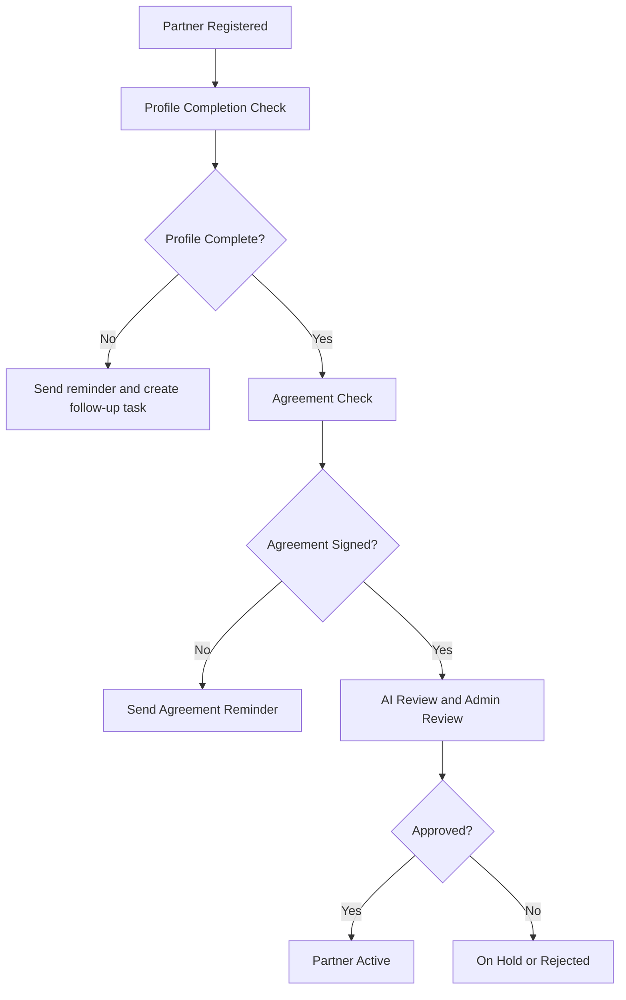

### 5.6 Partner Follow-up Flow

Follow-ups should be task-based.

Each follow-up should have:

- partner/contact ID
- assigned user
- due date/time
- channel: call, WhatsApp, email, meeting
- priority
- status: open, done, missed, rescheduled
- notes
- next action

Reminder rules:

- If profile is incomplete after 24 hours, send reminder.
- If AI profile is started but not completed after 48 hours, send reminder.
- If agreement is pending after 3 days, alert admin.
- If partner is approved but inactive for 15 days, create re-engagement task.

### 5.7 Partner Activity Timeline

Timeline should show all partner actions in order:

- registered
- logged in
- profile updated
- AI profile submitted
- agreement signed
- requirement submitted
- WhatsApp sent/read/replied
- email sent/opened/clicked
- call completed
- admin note added
- status changed

This gives the admin a real 360 view.

### 5.8 Partner Dashboard

Partner dashboard should show:

- profile completion
- agreement status
- submitted requirements
- enquiry history
- messages from BnC
- pending tasks
- recommended services
- documents
- support/contact option

Admin partner dashboard should show:

- total partners
- active partners
- pending partners
- profile completion funnel
- agreement pending list
- country-wise partners
- service-wise partners
- partner activity score

### 5.9 AI Use Cases for Partner Review and Reminder

Useful AI cases:

- summarize partner profile
- detect missing information
- score partner fit based on services, country, experience
- draft approval/rejection notes
- suggest next follow-up
- create WhatsApp/email reminder draft
- detect high-potential partners
- summarize voice requirements
- classify requirement into service category

AI should suggest, not auto-approve partners. Final approval should stay with admin.

---

## 6. Sales Lead Management Logic

Even though this subtask mainly names website, partner, WhatsApp and dashboard, a CRM 360 module needs sales lead logic also.

### 6.1 Lead Stages

Recommended stages:

1. New
2. Contacted
3. Qualified
4. Proposal Required
5. Proposal Sent
6. Negotiation
7. Won
8. Lost
9. Nurture

### 6.2 Lead Assignment

Lead owner can be assigned by:

- country
- service category
- partner type
- campaign
- round-robin
- manual admin assignment

### 6.3 Lead Priority Score

Score can be calculated from:

- company provided
- phone provided
- service selected
- message quality
- country/market
- source quality
- past activity
- WhatsApp/email response
- AI classification

Example:

```text
score = profile_score + source_score + engagement_score + AI_intent_score
```

### 6.4 Lead Follow-up Rule

- New high-priority lead: follow up within 2 working hours.
- Normal lead: follow up within 24 hours.
- No response after 2 attempts: move to nurture.
- Proposal sent: next follow-up after 2 days.
- Lost lead: record lost reason.

---

## 7. WhatsApp Automation Integration

### 7.1 WhatsApp Business API Flow

Recommended integration: WhatsApp Business Platform Cloud API or a BSP/vendor if easier for billing and support.

Basic flow:

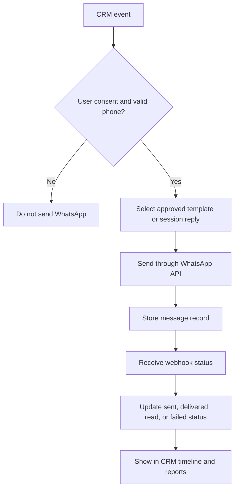

Research note: Meta WhatsApp Business Platform uses templates for business-initiated messages and webhooks for message/status updates. Pricing is normally based on Meta's current WhatsApp pricing rules plus any BSP/vendor charges.

### 7.2 Template Message Process

Template process:

1. Create message template in Meta/BSP panel.
2. Add category like utility, marketing or authentication.
3. Submit for approval.
4. Store approved template ID/name in CRM.
5. Map template variables.
6. Send only approved template for first outbound message.
7. Track delivery status.

Example templates:

- partner registration welcome
- profile incomplete reminder
- agreement pending reminder
- lead confirmation
- follow-up reminder
- campaign broadcast

### 7.3 Auto-Reply Logic

Auto-reply should be rule-based first and AI-assisted second.

Rules:

- If user says "pricing", send pricing/team callback response.
- If user asks service details, send relevant service link.
- If user wants partner onboarding, send partner registration link.
- If message is unclear, create task for human review.
- If outside business hours, send acknowledgement and create next-day task.

AI can suggest the reply, but a human approval mode should be used at start.

### 7.4 Bulk WhatsApp Campaign Flow

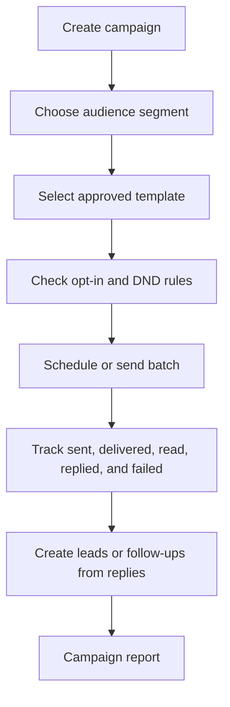

Campaign safety:

- send only to opted-in contacts
- use approved templates
- throttle sending to avoid quality problems
- stop contacts who opt out
- keep unsubscribe/stop handling

### 7.5 Lead/Partner Follow-up Messages

Examples:

- New lead confirmation
- Missed call follow-up
- Proposal follow-up
- Partner profile reminder
- Agreement reminder
- Inactive partner reactivation

Each sent message must attach to the CRM timeline.

### 7.6 WhatsApp Chat History Tracking

Store:

- contact ID
- phone number
- message direction: inbound/outbound
- message type: text/template/media
- template name
- message text or safe summary
- provider message ID
- sent/delivered/read/failed status
- timestamp
- assigned owner

### 7.7 Delivery/Read Status Tracking

Status values:

- queued
- sent
- delivered
- read
- replied
- failed

Webhook should update the same message record, not create duplicate records.

### 7.8 AI WhatsApp Reply Suggestions

AI can:

- summarize chat
- suggest reply
- detect intent
- detect language
- translate draft
- flag angry/urgent messages
- convert chat into follow-up task

AI reply should show as a draft first.

### 7.9 WhatsApp Reporting

Reports:

- total sent
- delivered rate
- read rate
- reply rate
- failed count
- template-wise performance
- campaign-wise performance
- lead conversion from WhatsApp
- opt-out count

---

## 8. Email Automation Integration

The current portal already uses Brevo Edge Functions for form notifications and voice requirement notifications. So email automation can be extended from the existing setup.

Research note: Brevo supports transactional email through API/SMTP and webhooks for events like sent, delivered, opened, clicked, bounced and unsubscribed.

### 8.1 Email Flow

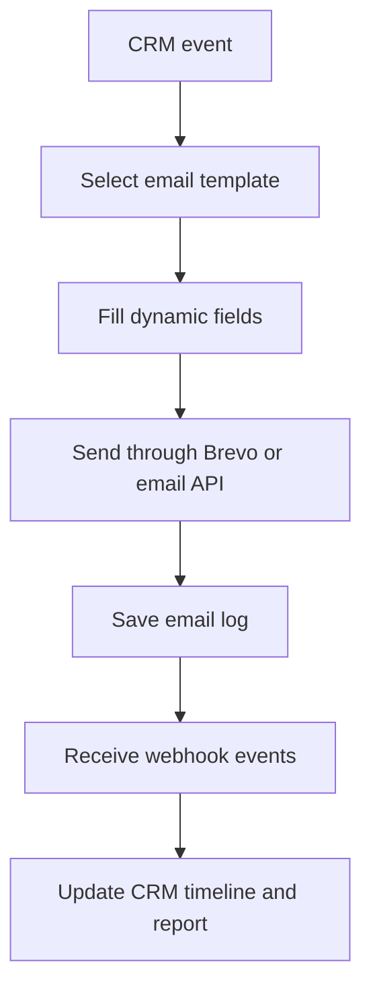

### 8.2 Email Types

- transactional confirmation
- internal admin alert
- partner welcome
- profile reminder
- agreement reminder
- lead nurture email
- campaign email
- proposal follow-up

### 8.3 Email Tracking

Track:

- sent
- delivered
- opened
- clicked
- bounced
- complained
- unsubscribed

### 8.4 Email Automation Rules

- Send confirmation email after form submission.
- Send internal alert to assigned team.
- Send reminder if profile is pending.
- Send campaign only to marketing opted-in contacts.
- Stop sending marketing email after unsubscribe.

---

## 9. Browser-Based Calling Logic

Browser calling can be done using Twilio Voice JavaScript SDK or similar provider.

Research note: Twilio Voice SDK supports browser/app calling, and pricing usually includes SDK/client usage plus normal programmable voice call leg charges based on destination and phone number.

### 9.1 Calling Flow

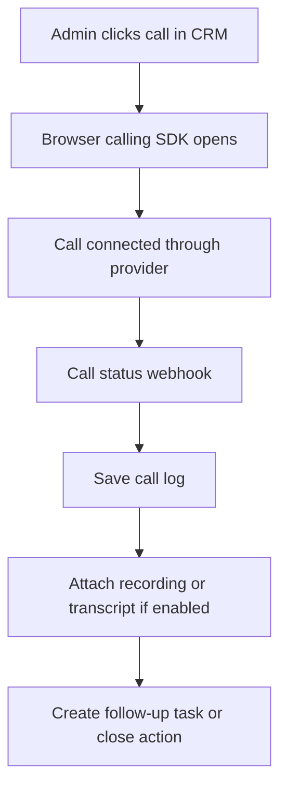

### 9.2 Calling Features

- click-to-call from lead/partner profile
- call notes
- call outcome
- missed call tracking
- call recording if legally allowed
- call transcript if enabled
- next follow-up after call
- calling dashboard

### 9.3 Call Outcomes

Use simple statuses:

- connected
- no answer
- busy
- wrong number
- call back later
- interested
- not interested
- converted

### 9.4 Compliance

Before call recording:

- check local call recording law
- show/record consent if needed
- store recordings securely
- limit access to admin/team only

---

## 10. AI Automation Logic

AI should reduce admin work, but it should not silently take final business decisions.

### 10.1 AI Use Cases

1. Lead summary
2. Partner profile summary
3. Lead scoring suggestion
4. Requirement classification
5. Follow-up suggestion
6. WhatsApp reply draft
7. Email draft
8. Call transcript summary
9. Duplicate detection suggestion
10. Dashboard insights
11. Stuck lead detection
12. Partner fit review

Research note: OpenAI function calling/structured outputs can be used when AI must return strict JSON like lead score, category, next action and confidence. This is better than parsing plain text.

### 10.2 AI Review Flow

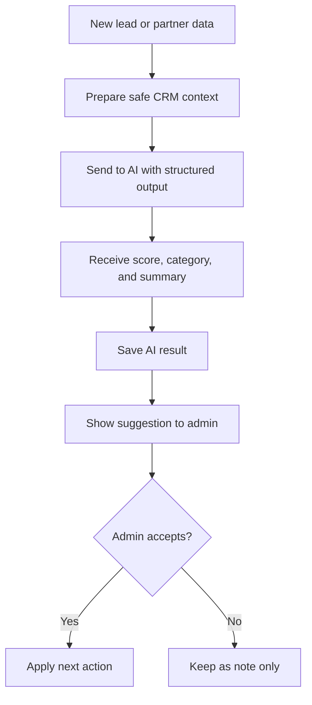

### 10.3 AI Guardrails

- Do not send unnecessary personal data.
- Mask sensitive document data where possible.
- Store prompt and response audit for important AI actions.
- Show confidence score.
- Do not auto-reject partners.
- Do not auto-send risky messages without approval.
- Keep human review for approvals, rejections and pricing commitments.

---

## 11. CRM Dashboard, Reports and Data Flow

### 11.1 CRM Overview Dashboard

Main KPIs:

- total leads
- new leads today/week/month
- open follow-ups
- overdue follow-ups
- total partners
- active partners
- pending partners
- agreement pending
- lead conversion rate
- campaign response rate
- team activity count

### 11.2 Website Data Dashboard

Show:

- form submissions by page
- lead source chart
- service/category interest
- top landing pages
- conversion by source
- duplicate submissions
- country-wise enquiries
- daily/weekly/monthly trend

### 11.3 Partner Dashboard

Show:

- registrations
- profile completion funnel
- agreement status
- partner approval pipeline
- partner activity timeline
- country-wise partners
- service-wise partners
- pending follow-up list

### 11.4 Lead Dashboard

Show:

- leads by stage
- high-priority leads
- owner-wise leads
- ageing leads
- source-wise conversion
- won/lost reason
- next follow-up date

### 11.5 Follow-up Dashboard

Show:

- today follow-ups
- overdue follow-ups
- completed follow-ups
- missed follow-ups
- follow-up by channel
- team member workload

### 11.6 Calling Dashboard

Show:

- calls made
- connected calls
- missed/no-answer calls
- average call duration
- calls by team member
- call outcome report
- follow-ups created after calls

### 11.7 Email Campaign Dashboard

Show:

- sent
- delivered
- opens
- clicks
- bounce
- unsubscribe
- template performance
- campaign conversion

### 11.8 WhatsApp Campaign Dashboard

Show:

- sent
- delivered
- read
- replied
- failed
- opt-outs
- campaign response rate
- template quality warning if provider gives it

### 11.9 Team Performance Reports

Show:

- assigned leads
- closed leads
- follow-ups completed
- overdue follow-ups
- average response time
- calls completed
- WhatsApp replies handled
- email replies handled
- conversion rate

### 11.10 Data Flow Between Modules

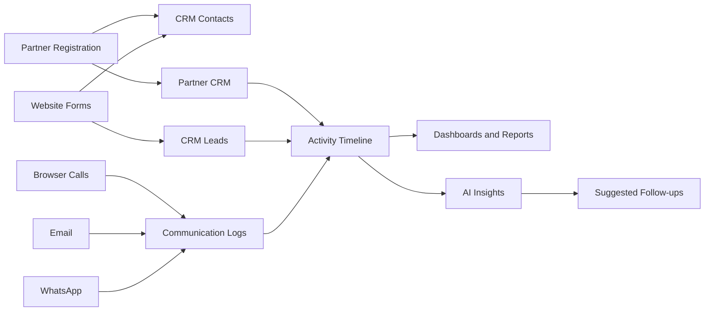

---

## 12. Recommended Database Requirements

Below is the suggested CRM database structure. Some current tables can stay as they are, but the CRM should add common tables around them.

### 12.1 Core CRM Tables

#### `crm_contacts`

Stores one person/contact.

Suggested fields:

- id
- first_name
- last_name
- full_name
- email
- phone
- country_code
- country
- city
- company_id
- contact_type: lead, partner, client, vendor
- original_source
- latest_source
- marketing_opt_in
- whatsapp_opt_in
- status
- created_at
- updated_at

#### `crm_companies`

Stores company/account details.

- id
- company_name
- website
- industry
- country
- city
- owner_id
- created_at
- updated_at

#### `crm_leads`

Stores sales/service lead details.

- id
- contact_id
- company_id
- lead_title
- service
- country
- source
- stage
- priority
- score
- assigned_to
- next_follow_up_at
- lost_reason
- created_at
- updated_at

#### `crm_partner_records`

Links partner portal data with CRM.

- id
- contact_id
- partner_id
- partner_email
- partner_type
- profile_completion_score
- agreement_status
- approval_status
- onboarding_status
- assigned_to
- created_at
- updated_at

#### `crm_activities`

This is one of the most important tables.

- id
- contact_id
- lead_id
- partner_record_id
- activity_type
- title
- description
- channel
- metadata JSON
- created_by
- created_at

#### `crm_followups`

- id
- contact_id
- lead_id
- partner_record_id
- assigned_to
- due_at
- channel
- priority
- status
- notes
- completed_at
- created_at
- updated_at

### 12.2 Communication Tables

#### `crm_whatsapp_messages`

- id
- contact_id
- phone
- direction
- message_type
- template_name
- body
- provider_message_id
- status
- error_message
- sent_at
- delivered_at
- read_at
- replied_at

#### `crm_email_messages`

- id
- contact_id
- email
- template_name
- subject
- provider_message_id
- status
- opened_at
- clicked_at
- bounced_at
- unsubscribed_at
- created_at

#### `crm_call_logs`

- id
- contact_id
- phone
- provider_call_id
- direction
- status
- duration_seconds
- recording_url
- transcript
- outcome
- notes
- called_by
- started_at
- ended_at

### 12.3 Campaign Tables

#### `crm_campaigns`

- id
- name
- channel
- audience_filter
- template_id
- status
- scheduled_at
- created_by
- created_at

#### `crm_campaign_recipients`

- id
- campaign_id
- contact_id
- status
- sent_at
- delivered_at
- opened_or_read_at
- replied_or_clicked_at
- error_message

### 12.4 AI Tables

#### `crm_ai_insights`

- id
- contact_id
- lead_id
- partner_record_id
- insight_type
- summary
- score
- category
- recommended_action
- confidence
- model_name
- input_hash
- created_at

#### `crm_ai_audit_logs`

- id
- action_type
- input_summary
- output_summary
- approved_by
- approved_at
- created_at

---

## 13. Integration Requirements

### 13.1 Supabase

Use Supabase for:

- Postgres database
- auth
- RLS
- Edge Functions
- storage for documents/audio if needed
- database webhooks or Edge Functions for automation

### 13.2 WhatsApp

Need:

- Meta Business verification
- WhatsApp Business Account
- phone number
- Cloud API or BSP account
- webhook endpoint
- template approval setup
- opt-in handling
- reporting tables

### 13.3 Email

Need:

- Brevo transactional email setup
- verified sender/domain
- email templates
- webhook endpoint
- unsubscribe handling for marketing emails

### 13.4 Calling

Need:

- Twilio or similar account
- phone number
- browser Voice SDK
- token generation endpoint
- call status webhooks
- recording/transcription setting if required

### 13.5 AI

Need:

- OpenAI or similar AI API key
- server-side AI function
- structured output schema
- logs/audit
- admin approval flow for AI-generated communication

---

## 14. Automation Logic

### 14.1 New Lead Automation

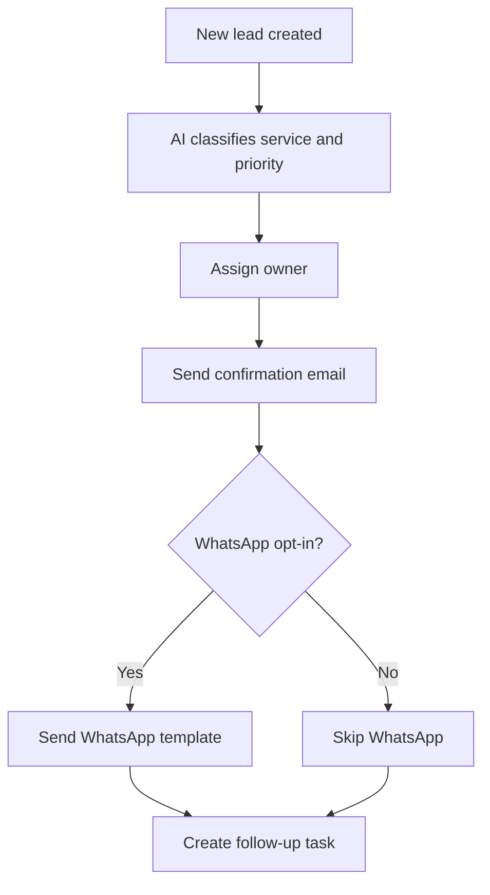

### 14.2 Partner Incomplete Profile Automation

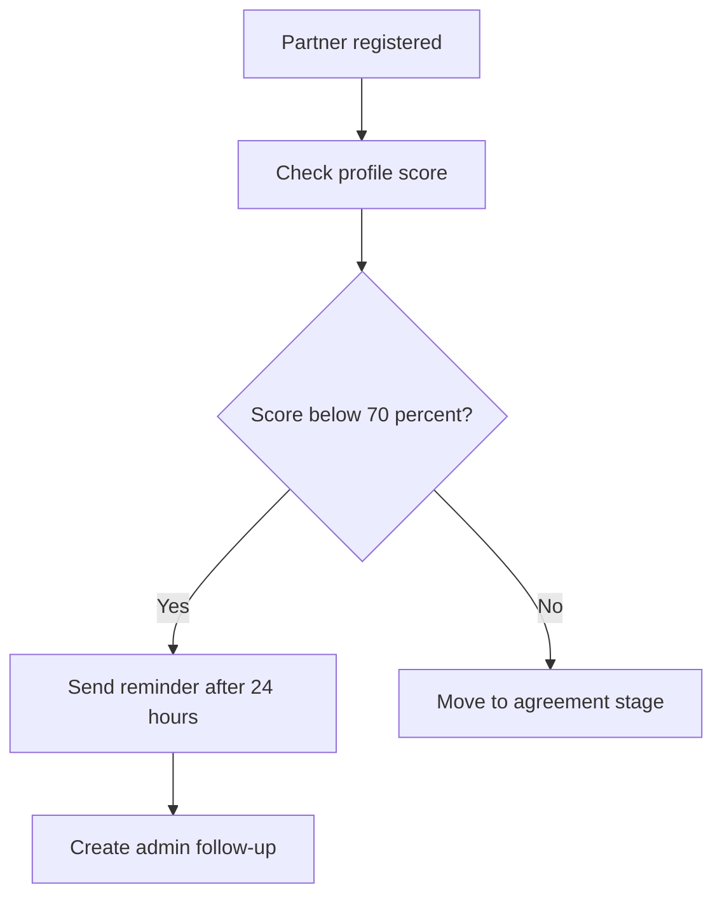

### 14.3 Agreement Reminder Automation

- Day 1: send email reminder
- Day 3: send WhatsApp reminder if opted-in
- Day 5: create admin call task
- Day 10: mark as cold/pending review

### 14.4 Campaign Reply Automation

- If user replies positively, create lead/follow-up.
- If user says stop/unsubscribe, update opt-out.
- If message is question, AI suggests reply.
- If reply is urgent, notify owner.

---

## 15. Cost Factors

Final cost depends on actual usage. This section is only planning level.

### 15.1 Main Cost Buckets

| Area | Cost Depends On |
|---|---|
| Supabase | database size, auth users, storage, Edge Function usage, bandwidth |
| WhatsApp | Meta message pricing, template category, country, BSP/platform fee if used |
| Email | monthly email volume, transactional emails, marketing emails, dedicated IP if needed |
| Calling | outbound/inbound call minutes, destination country, phone number rental, recordings, transcription |
| AI | tokens used, model selected, number of summaries/reply drafts/scoring runs |
| Storage | call recordings, voice notes, documents |
| Development | CRM screens, integration work, testing, security, deployment |

### 15.2 Cost Control Ideas

- Send AI request only when useful, not on every small click.
- Store AI summaries and reuse them.
- Use WhatsApp only for opted-in users and important follow-ups.
- Keep email for low-cost bulk updates.
- Archive old call recordings after a fixed time.
- Batch campaign reports instead of live recalculating everything.

---

## 16. Implementation Plan

### Phase 1 - CRM Foundation

Work:

- create CRM tables
- map existing partner/enquiry data to CRM contacts and activities
- add duplicate logic
- add lead stages and follow-up table
- improve admin dashboard navigation

Output:

- one CRM contact/partner view
- common activity timeline
- lead and partner list

### Phase 2 - Website Data Integration

Work:

- connect all website forms to CRM
- capture UTM/source data
- create raw submissions table
- add validation and spam checks
- create website dashboard

Output:

- all website enquiries visible in CRM
- source tracking working

### Phase 3 - Partner CRM Upgrade

Work:

- profile completion score
- agreement/document status
- partner approval workflow
- partner follow-up tasks
- partner dashboard reports

Output:

- complete partner lifecycle management

### Phase 4 - Email Automation

Work:

- setup email templates
- connect Brevo webhooks
- log email events
- create email campaign report

Output:

- email history and reporting inside CRM

### Phase 5 - WhatsApp Automation

Work:

- setup WhatsApp API/BSP
- create webhook endpoint
- template management
- message logs
- campaign flow
- reply tracking

Output:

- WhatsApp communication connected to CRM

### Phase 6 - Browser Calling

Work:

- setup provider like Twilio
- add click-to-call button
- save call logs
- add call outcomes
- optional recording/transcript

Output:

- calling dashboard and call history

### Phase 7 - AI Automation

Work:

- lead scoring
- partner review summary
- WhatsApp/email reply suggestion
- AI insights dashboard
- AI audit logs

Output:

- AI assistant for CRM team

### Phase 8 - Reports and Final QA

Work:

- team performance reports
- campaign reports
- conversion reports
- security review
- data accuracy testing
- user acceptance testing

Output:

- complete CRM 360 ready for production use

---

## 17. Risks and Points to Confirm

Before final implementation, confirm:

- WhatsApp provider: direct Meta Cloud API or BSP
- exact WhatsApp pricing for target countries
- email plan and sending volume
- calling provider and countries to call
- call recording legal rules
- data retention policy
- who can access CRM data
- admin/team roles
- required reports for management
- whether existing Supabase plan is enough

Small note: the CRM can become messy if all data is pushed without clear stages. So stage names, owner assignment and follow-up rules should be finalized early.

---

## 18. Research Sources Checked

The logic above was prepared after checking the current project files and these public docs:

- Supabase Edge Functions: https://supabase.com/docs/guides/functions
- Supabase Row Level Security: https://supabase.com/docs/guides/database/postgres/row-level-security
- Supabase Database Webhooks: https://supabase.com/docs/guides/database/webhooks
- Brevo transactional email API and webhooks: https://developers.brevo.com/docs/transactional-webhooks
- Brevo transactional email overview: https://help.brevo.com/hc/en-us/articles/7924148470546-How-can-I-send-transactional-emails-with-Brevo
- Twilio Voice JavaScript/Mobile SDK pricing note: https://help.twilio.com/articles/223180608-How-Does-Twilio-Voice-JavaScript-and-Mobile-SDK-Pricing-Work-
- Twilio Voice SDK docs: https://static1.twilio.com/docs/voice/sdks
- OpenAI function calling: https://platform.openai.com/docs/guides/function-calling
- OpenAI structured outputs: https://platform.openai.com/docs/guides/structured-outputs
- WhatsApp Business Platform docs main area: https://developers.facebook.com/docs/whatsapp/
- WhatsApp Cloud API docs: https://developers.facebook.com/docs/whatsapp/cloud-api/
- WhatsApp pricing docs: https://developers.facebook.com/docs/whatsapp/pricing/

---

## 19. Final Practical Recommendation

The best way to build this CRM is to start with the CRM data foundation first. If we directly start with WhatsApp, calling or AI, the data will still be scattered.

Recommended first build:

1. `crm_contacts`
2. `crm_leads`
3. `crm_partner_records`
4. `crm_activities`
5. `crm_followups`

After that, WhatsApp, email, calling and AI can be added cleanly because every action will have one place to attach.

This will make the existing portal work like a proper CRM 360 system and not just a dashboard with form data.
